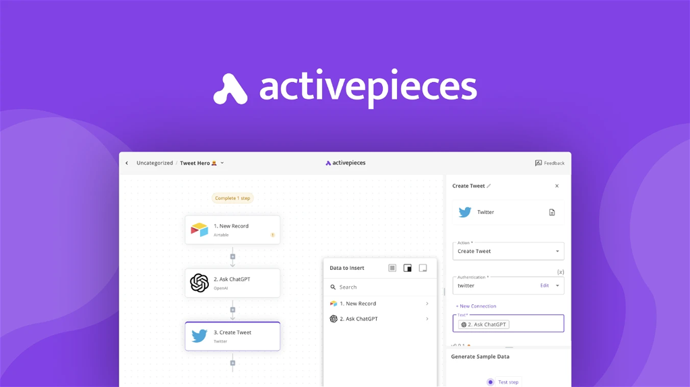

# Sábado, 16 de setembro de 2023

## ✨Plano de Ação
Vou listar aqui tudo que eu preciso fazer para poder lançar esse bagulho. Em alguns casos, teremos diferentes opções que podem ser escolhidas. Acho que devemos nos esforçar para lançar na segunda de manhã, tendo tudo preparado para o disparo das mensagens para os membros do prime por volta das 10 da manhã. Isso significa ter tudo pronto até no máximo umas 6h da manhã da segunda.
Para termos uma "régua", vou usar como base as promessas feitas na própria página de vendas do Next. Os pontos são os abaixo, já divididos por módulos. Outros temas que envolvem ~chores~ relacionados ao lançamento também serão listados.

### 1. Módulo Types
Os pontos prometidos na parte de types foram os abaixo. Vamos analisá-los um a um:

**~~1.1. Create CPT, taxonomies, and more that apply to the whole network - using a visual interface.~~**
Infelizmente, como ainda não temos nada pronto nessa parte e ela depende do painel de admin do Next estar pronto, não vamos ter tempo hábil para fazer agora. É algo que não estará presente na versão inicial a ser lançada.

**~~1.2. Define relationships between your types to encapsulate the business logic of your product.~~**
Mesmo problema do ponto acima. Infelizmente, no momento atual, não temos como fazer algo a tempo desse primeiro lançamento.

**~~1.3. Control which customers can access which types by combining Types with Access Gates.~~**
Isso é relativamente fácil de fazer diretamente relacionando types e access gates, mas não é necessário nesse momento, já que é relativamente fácil atingir o mesmo objetivo através do uso de Access Gates em determinadas páginas do painel de admin de um painel criado com o Studio. Podemos pular, por enquanto.

**1.4. Create custom features by triggering Workflows when an item is created, updated, or deleted.**
Isso aqui a gente ganha meio que "automaticamente" se terminarmos o item XX listado na parte dos Workflows, abaixo. Vou manter aqui, mas na lista final, provavelmente podemos fundir com o outro item e considerá-lo como algo só. Não vai dar para divulgar como "feito" até termos o sistema de tipos pronto e entregue, no entanto.

**1.5. Allow your customers to create, edit, and delete their collections you have created using Studio.**
Mesma lógica do item anterior.

~~**1.5. For devs: all types registered are available in code as `\YourNamespace\TypeName`  Eloquent models.**~~
Sem a estrutura de criação de Types pronta, não tem muito sentido em colocar isso, já que mudaria tudo, provavelmente. Vai ficar para depois também.

**1.6. Shared Types**
Para além dos itens listados na proposta acima, uma das funcionalidades que precisaremos desenvolver nessa parte de types, já que ela é um requisito para algumas das outras partes, é a adição de suporte a tipos `shared`. Tipos `shared` são custom post types que são compartilhados entre todos os sites da rede. 
Isso é um elemento necessário para todos os custom post types que estamos criando no core (como por exemplo access-gates, workflows, etc), já que criamos os workflows no painel de administração da rede, mas eles serão geralmente invocados no contexto dos diferentes sub-sites (seja ele um painel de administração de um sub-site normal, ou um site que foi utilizado para criar uma custom dashboard utilizando o Studio).
- [ ] Adicionar a funcionalidade de marcar um determinado CPT como `shared` entre toda a rede

### 2. Módulo Access Gates
Os pontos prometidos na parte de types foram os abaixo. Vamos analisá-los um a um:

~~**2.1. A user-role system compatible with Multisite, without the inconsistencies of the WP implementation.**~~
Esse item é mais uma encheção de linguiça de marqueteiro do que necessariamente algo acionável, mas é algo que precisa ser revisitado no futuro, à medida em que comecemos a receber feedback da galera usando as outras features do Access Gates.

**2.2. Control the visibility and access of certain features or content blocks visually, via access rules.**
Esse é de longe a parte que está mais prontinha, fechadinho, bonita e finalizada. Isso é a base do porque eu acredito que esse elemento é o que devemos utilizar para eventuais vídeos para gravar e colocar no post de lançamento e documentação.
Apesar de ser um item bastante adiantado em termos de implementação, ainda ficaram faltando detalhes para terminar. Alguns desses detalhes não são opcionais e precisam ser feitos para o lançamento. São eles:
- [ ] Adicionar suporte a option groups ao seletor de campos para comparação no editor de condições
- [ ] Implementar os demais operadores do editor de condições (atualmente, apenas o "=" e o "!=" funcionam)
- [ ] Adicionar método ao componente de edição de condições que permita limitar os operadores de acordo com o tipo do valor sendo comparado
- [ ] Testar os inputs padrão do editor de condições e se é possível estilizá-los apenas com CSS básico, dessa forma, eliminando a necessidade de re-implementar cada campo para cada tipo de comparação disponível.
- [ ] Implementar a conexão de páginas a Access Gates específicos
- [ ] Adicionar um data provider que tenha como base um workflow

~~**2.3. Improved performance when checking for user capabilities or roles, or evaluating access rules.**~~
Também é mais papo de marqueteiro que qualquer outra coisa. Não enseja nenhuma ação prática à essa altura do campeonato.

### 3. Módulo Workflows
Os pontos prometidos na parte de workflows foram os abaixo. Vamos analisá-los um a um:

**3.1. Create powerful custom features by chaining Action blocks together in the Workflows editor.**
Isso aqui é gigante, mas, infelizmente, não tem como shipar sem. 
É de longe a parte que vai gastar mais tempo e vai exigir um comportamento mais estratégico para não perder o senso da realidade e meter o louco. De certa forma, a maior parte dos elementos necessários para a implementação do editor de Workflows está pronto, mas serão necessárias algumas mudanças consideráveis.
Vou utilizar o layout que desenvolvi a muito tempo atrás, ainda quando estava trabalhando em provas de conceito para me certificar de que as funcionalidades que eu havia imaginado eram possíveis.
Para diminuir ainda mais a change de me perder no caminho de implementação disso, vou fazer um layout primeiro no Figma, pra não ficar perdendo tempo tentando achar o posicionamento ideal de cada elemento no layout, já que o ciclo de desenvolvimento dentro do editor é bem mais demorado que o normal e é um dos grandes ralos de tempo que têm me prejudicado essas últimas semanas.
Decidi simplificar bastante o trabalho do bloco em si, o que vai simplificar o trabalho de implementação, imagino eu. Como referência de uma visão "final", decidi deixar de lado o modelo do Zapier, que foca na inserção dos campos diretamente no painel (o que daria bastante mais trabalho para deixar bonito), para uma abordagem mais parecida ao **Active Pieces**, que segue o mesmo modelo clássico do editor de blocos, colocando o controle das actions na sidebar:

*Exemplo da interface do Active Pieces*
O próximo desafio, depois disso, passa a ser que actions incluir nesse pacote inicial de lançamento. Quero incluir, pelo menos o CRUD para postagens - ou seja - Create, Read, Update, and Delete. Também será necessário incluir actions relacionadas à usuários, como o CRUD, mas também login e logout.
A implementação da maioria desses itens é bem simples e alguns deles já estão até feitos e sendo utilizados em diversas partes do Next, o mais complicado é a parte de definição dos campos de cada action e como registrá-las no editor.
Meu plano até agora era registrar cada action como um bloco - que é como tenho feito até agora. Isso tem um ponto positivo: gera um volume grande de actions no painel, o que ajuda a dar a impressão de que os nossos workflows têm muitas opções já de cara. No entanto, depois de dar uma boa olhada nas demais ferramentas disponíveis no mercado, a grande maioria agrupa as actions por app. Acho que esse caminho é melhor, porque mantém as coisas mais organizadas e nos permite verrinar os app (conjuntos de actions, triggers, etc) ao invés de cada action, individualmente.
Por fim, quero ver se consigo incluir nessa primeira versão os endpoints da API do Ultimo como actions. Dessa forma, já teríamos o flow de cadastro de customer e site. Facilitaria muito a minha vida, porque ai não seria necessário implementar API endpoints do zero para adicionar esse tipo de funcionalidade.
Por fim, precisamos ter uma action de HTTP Request já de cara, porque é como base nela que eu poderei me conectar às APIs do Paddle para confirmar o status da assinatura do usuário e controlar o acesso aos downloads com base nisso. Essa action também me permitirá adicionar suporte às APIs do Freemius, Gumroad, etc, para poder ir adicionando novas funcionalidades em um segundo momento para usuários não-prime.
A action de HTTP também é importante porque vai servir de base para a implementação da integração com o WPCS. Tenho uma reunião com eles na quarta e preciso ter isso já mais ou menos "consolidado" na versão que os usuários estão testando até lá.
Essa parte de workflows também acaba encostando na parte de Forms e de blocos de form. Com isso, preciso ver que elementos dos formulários precisam ser implementados também. Vou adicionar os formulários como um item extra na lista de "promessas", ao final de tudo.
Outro ponto que julgo importante em termos de usabilidade é dar ao usuário a opção de mudar o tamanho da sidebar do editor de blocos. Eu tenho um código para isso, relativamente pronto, mas ele não está funcionando corretamente. Com isso, acho que o mais "rápido" seja copiar parte do código [de um plugin do repo](https://wordpress.org/plugins/resizable-editor-sidebar/) que adiciona essa funcionalidade.
- [ ] Fazer um layout básico de como vai ficar o editor de nodes do workflow no Figma e repassar ele com a @juliana antes de começar a implementar.
- [ ] Fazer o mapa de todos os triggers, actions e results que pretendo ter terminados para essa primeira versão. Para ter uma ideia de como agrupar os elementos, ver como o Zapier, N8N e Active Pieces fazem esse agrupamento.
- [ ] Preciso de uma lista de workflows prontos que precisam estar presentes. Esses workflows são oferecidos tanto como base para a criação de novos workflows, quando como "simple actions", que podem ser disparadas por elementos visuais dá página, como botões, forms, etc.
- [ ] Adicionar o plugin de resize da sidebar do block editor

**3.2. Tap into WP Actions and Filters without writing a single line of code, by using our visual editor.**
Isso aqui depende basicamente da adição de dois triggers: Hook e Filter. Essa lógica já foi implementada na versão de prova de conceito dos workflows. Basicamente, vou precisar mover essa lógica para dentro do novo esquema de workflows.
Apesar de na minha cabeça isso parecer simples, existem uma série de questões que precisam ser levadas em consideração aqui. Uma das principais é a validação dos valores, no caso de filtros. Filtros esperam um valor como resultado, senão o resultado pode ser catastrófico. Isso é algo que devemos fazer de uma vez, ou pode ser delegado a um segundo momento pós-lançamento? ~Pensando de maneira lógica, acho que pode ser adiado~.
 Outra coisa que pode trazer dificuldades técnicas consideráveis é o parcelamento de cada action e filtro para pegarmos a lista de parâmetros. Essa tarefa precisa ter um limite de tempo bastante específico, ou pode virar um ralo de tempo também. Por mais que eu queira pensar que sim, não é algo que se faça em 1h, mas sim algo que demoraria ao menos umas 4h de trabalho, no mínimo. Dessa forma, pode ser melhor, na verdade, nem incluir isso na lista final dessa maratona, na verdade.
- [-] Implementar o Trigger: Filtros e Hooks

**3.3. Use our powerful "PHP Code" action to write your own custom workflow actions, if you want to.**
Essa aqui segue bastante a lógica do item anterior. Está praticamente pronto, fruto de uma implementação de prova de conceito anterior. No entanto, ela é poderosa, porque me permite implementar custom actions com PHP diretamente, sem a necessidade de escrever uma action da maneira "formal". Como ferramenta para ajudar os membros do prime a validarem teorias, acharem bugs, e até mesmo servirem de "pad" para escrever provas de conceito rápidas para uma nova action, tem um potencial de ajudar muito.
Mesmo com isso em mente, acho válido estabelecer um tempo limite máximo. Também é importante que o processo de seleção e implementação do "editor" de código a ser utilizada tem o potencial de ser um grande time-hog. Dessa forma, é interessante que essa decisão seja feita e testada antes mesmo do início da implementação do resto das coisas.
Se não for possível adicionar no tempo que temos para agora, não há problema e podemos adicioná-la ao longo da semana, especialmente se o fluxo de releases for ser mais acelerado.
- [ ] Selecionar que editor de código vai ser utilizado para essa parte de edição das actions de PHP

**3.4. Run heavy-duty Workflows in the background using our powerful queue system.**
Esse item também é bastante complicado, já que a parte da infraestrutura está relativamente pronta, mas ao mesmo tempo, não está. A ideia é que queremos deixar que workflows mais pesados sejam rodados no background, através da job queue do Laravel.
Em tese, isso é relativamente simples de fazer, o problema é realizar na prática.
A questão fundamental é que a forma de implementação dos workflows depende diretamente de como a integração deles com as queues é feita. Fazer eles primeiro, para só integrar o suporte à queues num segundo momento nos expõe ao risco de ter que refazer toda a parte de workflows.
~Eu não acho que é um risco válido, então teríamos que já implementar o suporte aos workflows com suporte à rodar esses workflows no background.~
Com base nessa informações, julgo que seja importante que a parte de design do painel de administração de workflows incluam os controles referentes ao modo de execução de um workflow que rode no background.
- [-] Definir no design da página de edição de workflows onde o toggle de rodar tal workflow no background.
Na verdeado, pensando um pouco melhor no item acima, me surge uma dúvida: para alguns workflows, é óbvio o fato de que eles serão rodados no background (como os que tem como trigger uma hora do dia, por exemplo), para outros, no entanto, pode fazer sentido rodá-los diretamente na request ou no background em diferentes cenários. 
Com isso em mente, não seria melhor que a definição de que modo utilizar para a execução de um workflow fique como responsabilidade do disparador (botão, formulário, etc)? Me parece que esse é o caso...
- [ ] Ter uma lista de elementos e blocks que terão acesso aos controles de disparo de um workflow.
- [ ] Definir como apresentar o controle de em que modo rodar um determinado workflow deverá ser exibido nas configurações do disparador.
- [ ] Quando rodando no background, devemos dar opções de configurações de mensagens que comuniquem ao usuário que o processo começou corretamente, terminou, e ou falhou. Precisamos definir onde ficarão esses controles também.
Outra coisa importante: a depender do modo de execução, alguns results terão execução diferente (front-end vs. backend). O exemplo que consigo pensar agora é o result de redirect. Quando ela rodar no front-end, basta mandar uma redirect response. No caso de algo que rodou no background e retorna um redirect, isso precisará ser feito pelo javascript. 
Um modo "prático" de fazer isso seria testar se o Unpoly é capaz de dar um eval num snippet de JS que faça o redirect incluído na resposta do unpoly.
- [ ] Pensar como utilizar a lógica do Unpoly para lidar com redirects no front-end.
- [ ] Pensar o sisteminha de noticações utilizando o unpoly. Nesse item é ~muito importante~ que eu resista à tentação de querer fazer um sistema super elaborado de notificações nessa versão inicial, e utilizar a parte de flash messages do Laravel, com um design bem básico, utilizando o Tailwind, caso seja necessário.

**3.5. Share your Workflows with the community for free or for a price on the Ultimo Marketplace.**
Não haverá marketplace nessa primeira versão, porque não faz sentido ainda. No entanto, o próprio WordPress tem as funções necessárias para exportar um post de blocos e importá-lo em outra instalação. Podemos apenas adicionar um controle que permita que isso seja feito na página de edição de um workflow.
Apesar de simples, a prioridade desse item seria bastante pequena, apesar de também ser uma ferramenta interessante para debug de problemas que os usuários que estão testando estão tendo, porque nos permite rodar os workflows deles e ver o que deu errado.
Acho que pode ser feito logo depois do lançamento da primeira versão ser lançado. Vou adicionar o item aqui embaixo, mas já podemos marcar para um segundo momento.
- [-] Adicionar botões para exportar e importar um workflow na tela de edição.

~~**3.6. Use the power of our AI to create workflows by describing what you want to achieve in plain English.**~~
Esse item conversa diretamente com o AI Assistant. Não é algo que vamos conseguir incluir no lançamento inicial, até porque quero fazer um estardalhaço da porra quando isso estiver pronto.
Vai ficar para um segundo momento e precisa ser muito bem pensado. Também depende do sistema de types estar completamente pronto para ser efetivo.

### 4. Módulo Studio
Os pontos prometidos na parte do studio foram os abaixo. Vamos analisá-los um a um:

**4.1. Create admin panels from scratch, using the block editor and our collection of block patterns.**
Isso está pronto e não está. De novo, o problema aqui é a parte de marcação de um site como um site do studio. Se conseguirmos utilizar as actions do Ultimo para termos um endpoint de criação de um novo site, sai bastante rápido, mas depende da parte de workflows pronta (pelo menos a "engine").
Dado isso, temos uma série de perguntas que precisam ser respondidas antes que essa parte de criação do site seja implementáveis, como, por exemplo, como e onde implementaremos o painel do Next em si.
~Uma opção viável que evita essa pergunta, é utilizar a própria página de listagem de sites e a modal de criação de sites do Ultimo para apenas injetar um novo tipo, chamado "Admin Panel".~
Pensando aqui, acho que essa é a melhor opção, porque nos permite também demonstrar uma certa "integração" entre o Next e o WP Ultimo, além de ser relativamente simples de executar.
- [ ] Adicionar um novo tipo de site no Ultimo - Admin Panel - , oferecendo-o como opção de tipo de site na lista de tipos viáveis. Se eu não me engano, inclusive, eu já tenho código para isso em alguma branch maluca minha ai (provavelmente a que tá lá no Local), o que deixaria tudo ainda mais simples.
- [ ] Essa escolha adiciona uma dependência direta entre o Next e o WP Ultimo. Isso quer dizer que vai começar a fazer sentido incluir o Ultimo como algo a cobrar (e em uma determinada versão), antes de ativar o next. Essa lógica deve ser incluída no PR do @yan que adiciona essas checagens e que precisa ser incorporado à main. [PR-20](https://github.com/next-press/vault/pull/20)

~~**4.2. Create internal admin panels and tools for you to manage your WaaS and follow key metrics.**~~
Isso é também marketing. É útil para a produção de vídeos e tutoriais para ajudar o povo a entender como o Next é útil, mas depende parcialmente em todos os módulos estarem ao menos funcionais. Com isso, podemos deixar "de lado", ao menos temporariamente.

**4.3. Offer your customers a Single Page App experience with Studio's powerful optimization features.**
Mais uma vez, **marketing**. Dessa vez, no entanto, já temos quase tudo funcionando. Isso se dá porque o *heavy-lifting* é feito pelo Unpoly. A gente já consegue anunciar isso como uma vantagem foda. Se for possível já incluir suporte básico a PWA de cara, o que é bastante simples de fazer, dá para dar um boot nessa claim ainda mais.
Ai a questão passa a ser as opções de customização que vamos oferecer e que nível de controle os usuários terão sobre como o unpoly cuida de cada item, individualmente.
Por padrão, todos os links estão sendo controlados pelo Unpoly, mas isso não é o ideal. Preciso corrigir para que os links que apontam para o wp-admin, por exemplo, sejam ignorados.
- [ ] Afinar o comportamento do Unpoly ao lidar com todos os links, adicionando uma lista de itens que devem ser ignorados.
- [ ] Adicionar controle sobre se o formulário deve ser controlado pelo Unpoly ou não.
- [ ] Ver qual o nível de dificuldade de incluir um controle do unpoly em cada elemento que abre um link, como core/buttons ou navigation items, por exemplo. Imagino que com o meu bloco de fields dinâmico para o editor, seja algo relativamente simples de fazer.

**4.4. Blazing fast loading times thanks to Studio's support for caching plugins, block lazy-loading.**
A primeira parte, de novo, é uma simples consequência do uso do Unpoly. Já a segunda parte é mais interessante. É algo de simples implementação, e bastante poderoso, mas precisa de um desenho de uma implementação, para não virar um ralo de tempo, também. 
Imagino que seja possível utilizar como base o bloco de Content Gates, para adicionar um bloco de loading, um de erro, e o do conteúdo. Com isso, teríamos que dar a opção de transformar um bloco de grupo em um bloco de "Lazy Loading".
Eu acho uma feature foda de ter para o lançamento, mas tem que ter um tempo máximo também, para não perder muito tempo.
- [ ] Utilizar o bloco de Content Gates como base para a implementação de um bloco de lazy loading de conteúdo

~~**4.5. Build as many admin panels as you want and assign them to different access rules, products.**~~
Isso é uma consequência direta do fato de ser possível criar múltiplos sites numa rede, e marcar vários como admin panels. Não é actionable e está intimamente ligado ao item 4.1.

~~**4.6. Share your custom panels with the community for free or for a price on the Ultimo Marketplace.**~~
Não tem como fazer por enquanto, mas tem lógica similar ao item 3.5.

#### Items que são consequência lógica das promessas, mas não foram incluídos nas promessas em si

**4.6. Tema padrão de um site do tipo app - The Shell**
Para adicionarmos nossos elementos, blocos, estilos, etc, a gente força o tema ativo de um site do tipo studio app a utilizar o tema "the shell", removendo do usuário a possiblidade de trocar o tema para esses sites em particular. 
A tela `themes.php` dos sub-sites com tipo studio app já está recebendo um lock que avisa dessa impossibilidade para o network admin.
Fica faltando apenas dar um tapa na functions.php do tema, remover alguns bugs que ela está introduzindo, e mover eventuais blocos de lógica que estão por lá para os módulos onde eles fazem mais sentido.
Também é necessário terminar a cobertura de elementos básicos de um block theme no `theme.json` do tema. Eu imagino que isso possa ser alcançado relativamente rápido com a ajuda do ChatGTP, especialmente considerando que os estilos são todos portados do tailwind e quem fez isso originalmente foi o próprio GPT.
- [x] Forçar a seleção do Shell como tema padrão nos sites criados como app @done(2023-09-14 11:58)
- [ ] Limpar o Shell Theme, principalmente o `functions.php`
- [ ] Elementos-padrão, seguindo o padrão do Tailwind

**4.7. Feature de conteúdo dinâmico**
Uma das funcionalidades mais importantes do Studio é a parte de conteúdo dinâmico. Esse elementos ~definitivamente~ precisa ser incluído nessa versão inicial, em alguma capacidade.
A base está pronta e funcionando. Também está bastante "expandível". O trabalho que falta agora é braçal e na parte de UI.
Isso têm sido um grande buraco de tempo, em grande parte porque eu não tirei um tempo para pensar um design para os elementos antes de pegar para fazer na prática. Como o ciclo de desenvolvimento dentro do editor é bastante mais lento, isso vira uma bola de neve.
Com isso, é super importante que eu faça conceitos e designs antes de partir para a parte da implementação diretamente falando.
- [ ] Pensar design inicial dos elementos relacionados à funcionalidade de conteúdo dinâmico do studio

**4.8. Bloco de Ícone**
O studio inclui um bloco de ícones que tem papel fundamental em muitas das funcionalidades. Ícones, no geral, são um elemento primordial de interfaces de administração. Por esse motivo, como o WordPress não oferece um bloco padrão de ícones, temos que fazer nós mesmos.
No entanto, acho que posso ter escolhido uma abordagem ruim para como implementei o suporte à ícones. Ao invés de fazê-lo via um bloco, acho que o melhor caminho teria sido utilizar a ferramenta de Rich Text para incluí-los inline.
Tendo isso em vista, quero adicionar um plugin ao sistema de Rich Text que adicione o seletor de ícones também como um format inline.
Isso me permitiria simplificar bastante a parte de controle de tamanho do ícone, já que isso só seria uma preocupação para o bloco de ícone, não o formatado Rich Text.
- [ ] Ver como outros plugins que adicionam um bloco de ícone implementam, tanto como bloco, quanto como formatador Rich Text.
- [ ] Fazer um design básico dos controles de ícone, para a versão formatado e bloco

### 5. Connect
Os pontos prometidos na parte do Conenct foram os abaixo. Vamos analisá-los um a um:

**5.1. Off-load sub-sites to single installs with one click, while keeping them connected to your WaaS.**
Esse item é pouco actionable, já que ele simplesmente descreve o que o Connect faz como um todo, kkk.

**5.2. Connect offers a selection of hosting providers to choose from. Link as many as you want.**
Eu e o @gustavo trabalhamos no desenvolvimento das integrações do Runcloud e do ServerPilot, mas ambas estão feitas pela metade (funcionam, mas não tem as checagens necessárias para lidar com erros). Além desses itens, havíamos prometido suporte ao DigitalOcean.
Infelizmente, acho que para essa versão inicial não temos como incluir o Connect. Ele deve ser uma das prioridades absolutas depois da liberação inicial. Se sair nessa semana, seria incrível. Podemos liberar com apenas um provider, e ir liberando os demais com o tempo.
Outro elementos importante que nos obriga a trabalhar nesse item logo depois da liberação inicial é o fato de termos uma reunião com o WPCS na quarta-feira, que depende de ter pelo menos um provedor implementado, para que eles tenham um exemplo de como fazer a integração deles.

**5.3. Manage external sites as if they're part of your WaaS and without keeping things in sync.**
Esse item depende do item acima. Na verdade, não depende não... Isso é interessante. Talvez compense tirar um bloco de uns 30-50 minutos para ver o que dá pra desembolar nessa parte de conexão, sem a necessidade da migração.
Eu baixei o conector do InstaWP para termos uma referência. Se bobear, podemos fazer modificações nele e ver se já rola de incluir, mesmo que de maneira bastante preliminar. Como é uma feature que a galera têm pedido muito, eles verem que ao menos uma parte "está pronta", pode ajudar com a confiança.
- [ ] Verificar a viabilidade de lançar apenas o Connect Client, com base no InstaWP connector

~~**5.4. Automate site offloading by attaching a provider to a product and letting Connect do the rest.**~~
Esse item depende do 5.2.

~~**5.5. Bypass the SSL certificate 100 domains limit of some providers by having Connect manage them.**~~
Esse item depende do 5.2.

### 6. AI Toolkit
Os pontos prometidos na parte de AI Toolkit foram os abaixo. Vamos analisá-los um a um:

~~**6.1. Add new types, workflows, and more using the power of our AI, by describing them in plain english.**~~
Isso aqui definitivamente não tem como fazer agora. Depende da parte de types estar pronta e de uma reestruturação do código que eu tenho agora para o assistant.

**6.2. Leverage our AI Workflow Actions to expose auto-generational features to your end customer.**
Esse item é interessante. Ele não passa muito de um wrapper ao redor da API da OpenAI. Com isso, a gente pode simplesmente oferecer uma action ou um grupo de actions que vai bater na nossa proxy api da OpenAI, ao invés de bater neles direto.
Dai, podemos oferecer algumas actions especializadas, bem simples. Exemplos poderiam incluir coisas como "gerar meta-description" para uma postagem, por exemplo. também podemos ver quais são os resultados para uma action de geração de um layout, por exemplo, ou de uma página baseada em blocos para o site do cliente.
Sob interesse de ter um item de cada feature prometida incluído nesse lançamento inicial, acho que é válido tentar incluir, mas pode ser que não dê mesmo, por uma simples questão de tempo. De qualquer forma, mesmo que essa seja o caso, podemos incluir na lista de itens para atacar já nessa primeira semana.
Outra coisa que isso envolve é o fato de que os usuários primes terão "créditos" para utilizar com ações que chegam na api da OpenAI. Com isso, vamos precisar calcular quantos créditos dar para cada usuário por mês, e comparar isso com o preço dos tokens e o valor pago pela assinatura deles.

~~**6.3. Understand your business better by using our AI to analyze your data and generate reports.**~~
Também não temos como fazer isso ainda.

### 7. Marketplace
Os pontos prometidos na parte de Marketplace foram os abaixo. Nesse momento, no entanto, não faz sentido implementarmos o marketplace. Temos muito pouca informação sobre como vai ser o uso da galera para focar nisso. Vamos pular essa parte toda. por agora.

~~**7.1. Get access to a growing library of types, workflows, and more, created by other WaaS owners.**~~
~~**7.2. Share your custom types, workflows, and more with other WaaS owners, either for free or for a price.**~~
~~**7.3. Build on-top of what's already there and save time by not having to reinvent the wheel.**~~

## Outros Items
Para além dos items que foram prometidos para o pessoal, também temos que fazer os itens que permitem que as coisas cheguem até os usuários, que o produto possa ser distribuído, etc. Vou listar isso aqui em baixo, para que não os percamos de vista.

### 8. My Account
Como bom idiota que sou, simplesmente ~apaguei~ todas as páginas que eu tinha criado para o painel do My Account. Recuperei a base do layout, mas as páginas não eram parte do backup que eu usei (que era antigo). Não vou ter que começar do nada, mas também não tem muita coisa feita.
Vou ter que recriar todas as páginas. A estrutura que eu havia pensado era a seguinte:
1. Página de Login
2. Página de Registro? *Não seria necessária se a gente for enviar o convite só para quem é prime, na segunda.*
2. Home: Apenas um bloco falando para o usuário que tudo que ele ver nesse site foi criado utilizando o Next, e apontando para recursos, como o site da documentação
3. Downloads: Página onde o usuário pode realizar o download dos plugins: Next, WP Ultimo v2, Horizon (que lida com a queue), Connect Client, Connect Server
	4. Aqui, acho que posso implementar utilizando um custom post type + customizações ao bloco de Query Loop (para implementar a parte de utilizar um workflow como base para a implementação de uma variação do query loop que loop não posts, mas o retorno do bloco.
5. Updates: Um custom post type onde vou ficar postando novidades e vídeos de atualizações. Seria basicamente um bloco de RSS que puxe uma categoria de postagem específica do blog do Ultimo.
6. Your Subscription: tela onde os usuários seriam capazes de gerir a assinatura do prime deles, com os links de gerenciamento do Paddle. Aqui eu também teria a oportunidade de implementar a funcionalidade de utilizar um workflow como um data provider para preencher elementos da página com o dinâmico content.
Com base nisso, temos as seguintes tarefas derivadas:
- [ ] Re-criar o conteúdo das páginas do my account
- [ ] Ná página de downloads, mostrar os plugins disponíveis. Isso deve fazer uso da URL de update e meta-data que já implementamos anteriormente. Devemos utilizar o bloco de query e um custom post type para mostrar os elementos. Não devo tentar incluir inputs nesse CPT, e preencher os valores utilizando o banco de dados diretamente, para agilizar.
- [ ] Pensar em como implementar esse bloco "alternativo" ao bloco de query loop. Deve ser uma variação? Deve ser outro bloco? Não sei ainda. A vantagem de utilizar os blocos padrão do WordPress e talvez só adicionar um campo para substituir o conteúdo por conteúdo dinâmico é que patterns existentes podem ser utilizados com conteúdo que não é um post. Isso aqui, pensando melhor, é genial, porque permite que blocos e patterns desenvolvidos para outros temas podem ser utilizados com o studio sem a necessidade de reescrever nada.
	- [ ] Pensar em como implementar essa opção de substituir o conteúdo de um bloco com o conteúdo injetado de um provedor de conteúdo. Se os dados retornarem já forem no formato esperado, já podemos fazer até o match de maneira automática.

### Documentação & Lançamento
Agora vamos à parte de documentação e da logística de lançamento. Eu já comecei a escrever a documentação. Estou utilizando uma ferramenta de documentação bem simples, baseada em markdown, mas sinceramente, acho que poderíamos fazê-lo até diretamente no Github, direto no markdown, até para permitir que as pessoas façam contribuições, se quiserem, e ganharmos mais tempo para escolher um layout legal, ou já incluir no nosso micro-saas de documentação, no futuro.
- [ ] Mover a documentação para markdown no Github, em um repo aberto. Incluir instruções para contribuições. Preciso ter um outline legal de que pontos escrever, escrever uma base, e pedir para a @juliada corrigir, expandir com o GPT, tirar screenshots, etc.
- [ ] Precisamos de um post de lançamento que explique o que estamos liberando naquele dia, links os recursos, explique por cima como acessar os plugins, etc. Ele não necessariamente precisa ser grande, mas o ideal é que passe uma ideia da grandiosidade do lançamento.
Aqui eu também preciso decidir se tento incluir um vídeo de uma funcionalidade já melhor terminada, como Content Gates, ou não. Se sobrar tempo, acho que é muito válido, já que já dá um sneak-peak visual para o usuário que não é prime de como as coisas funcionam. Também nos permitiria incluir esse vídeo na página de documentação. Outro bom candidato para gravar como um vídeo rápido cobrindo uma funcionalidade é a parte de dynamic content. Não precisamos gravar liberar tudo no mesmo dia, no entanto. Talvez seja interessante até ir lançando eles em dias diferentes para hypar e vender essa merda.
- [ ] Pensar se compensa já tentar gravar vídeos para a postagem de lançamento, ou se é algo que deixamos para o largo da segunda ou terça-feira.
- [ ] Talvez gravar um vídeo rápido sobre a postagem de lançamento (basicamente uma versão em vídeo do post de lançamento), só para mostrar a cara e que estou vivo?

### Outros Ajustes
Os ajustes abaixo são relativamente pequenos e podem ser incluídos todos em um bloco de 30 a 50 min de trabalho. 

- [ ] Remover a `public/index.php` do build
- [ ] Utilizar o código do Yan para checar os pré-requisitos
- [ ] Rodar as Migrações
- [ ] Mover o Concern `AsNode` para o Auroro, removendo-o do Next
- [ ] Fazer uma classe na estilo da `Auroro\Support\Plugin` para temas, também, e aplicar no Shell
- [ ] Adicionar os comandos de [otimização](https://laravel.com/docs/10.x/deployment#autoloader-optimization) ao script de build