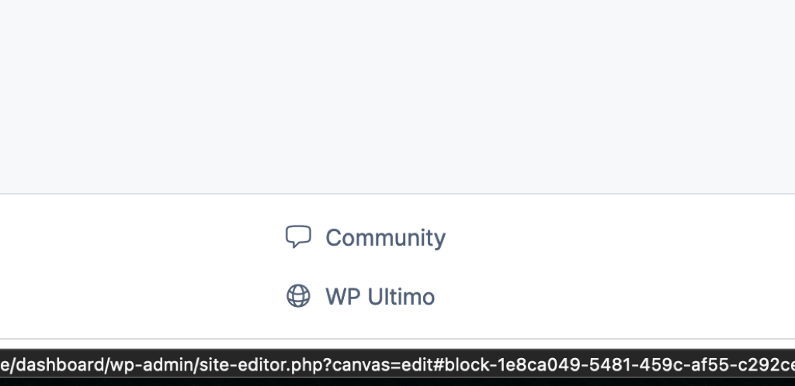

::10:18:: No momento em que escrevo isso, estou muito ansioso, me dando conta das coisas que preciso fazer ao longo desse dia, e remoendo as coisas que eu não fiz nos dias anteriores. Estamos num momento de breaking point, e preciso parar de considerar o que foi o passado para que eu possa considerar o que é o futuro.
Com o @allyson tocando as coisas dos projetos e a @juliana tocando a parte de administrativo e conteúdo, agora, eu só preciso focar em fazer as coisas que eu realmente me propus a fazer, e me tornar disponível para os membros do prime.
Vamos começar com refazer o admin panel, e estabelecer o sync entre a minha instalação local e a instalação remota, hospedada no Runcloud.
Apesar de estar enrolado, ~não vou delegar~ nem a ida ao mercado, nem o passeio do @vily. Posso até fazer versões menores, mas as farei.
Tendo dito isso, é hora de começar sem me perguntar por onde, ou fazer planos mirabolantes. Vamos de recriar o painel de administração do My Account.

#### ✅ Lista de Tarefas
- [ ] Recriar o painel do My Account as CTO ^ofzgit
- [x] Marcar site como um admin site via settings @done(2023-09-20 12:05)
- [x] Remover os estilos do editor de workflows do site editor @done(2023-09-20 12:05)
- [x] Fazer o unpoly funcionar somente em studio apps @done(2023-09-20 12:50)
- [x] Remover a Studio Sidebar @done(2023-09-20 12:57)
- [ ] Meio de editar um workflow no painel de administração ^n7fgzh
- [ ] Botão para disparar a mudança de um site para studio app ^saj56y
- [ ] Modelo de secrets? ^eacfh9
- [ ] Testar actions individualmente ^tn4sf4
- [ ] Repositório de template para novas extensões no `auroro/extension` ^nqgeqs

#### 🚀 Para a chamada com o WPCS
- [x] Repositório comunitário para eles @done(2023-09-20 17:19)
- [x] Repositório do `auroro/support` como público @done(2023-09-20 17:20)

#### 💰Reunião com o a nova contabilidade
- [x] Responder a Débora @done(2023-09-20 20:10)

#### ⚠️ Baixa prioridade
- [ ] Navigation itens com ícones não ficam inline

#### 😀 Pessoal e Outras
- [x] Comprar café
- [x] Escovar dentes e colocar a placa
- [x] Enviar dinheiro para o N26 para que a Adeslas possa cobrar @done(2023-09-20 17:21)

## 📎 Notas e anexos
 
> Navigation items com ícone não fica inline
