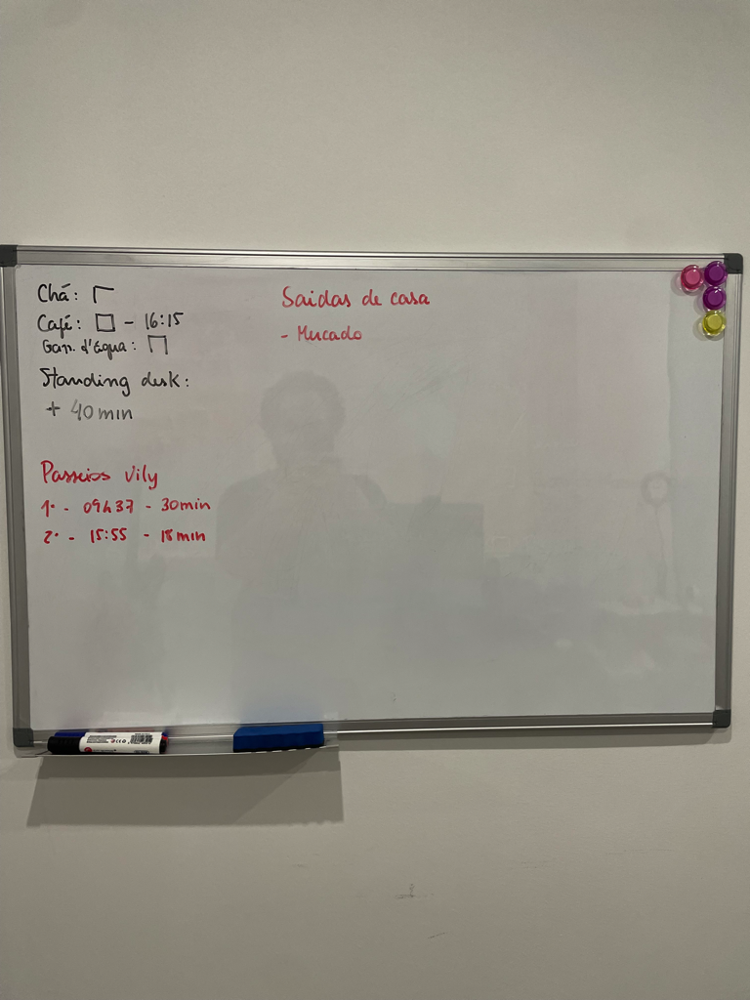

# Terça, 17 de outubro de 2023
##### Sessão 1
::05:50:: Acordei por volta das 05:12 hoje. Ao invés de tentar dormir mais, como me senti bastante desperto, decidi levantar e começar o dia. E é o que vou fazer. Vou usar essa parte da manhã para tomar um chá, organizar o resto do dia e me certificar que estou me ~programando para o sucesso~, não ironicamente. Para isso, quero colocar algumas regrinhas:
+ [-] Ter dormido por pelo menos 6h de sono (não de cama)
+ [x] Primeiro passeio do @vily até as 9h30
+ [x] Sem café durante os 120 minutos após acordar
+ [x] Sem comer até o meio-dia
+ [x] Sem TV ou Youtube antes das 15h da tarde
+ [x] Segundo passeio do @vily até as 16h00
+ [x] Tomar no máximo 4 xícaras de café no dia
+ [x] Sem fone de ouvido ou podcast na rua até as 18h
+ [x] Tomar a última xícara de café antes das 18h
+ [x] Ter comido pela última vez até às 20h
> 20h34, tecnicamente
+ [-] Terceiro passeio do @vily até as 22h00
+ [x] Tempo total de passeios de no mínimo 45 minutos (média de 15 por passeio)
+ [x] Estar na cama antes da meia-noite
+ [x] Fazer pelo menos 30 minutos de standing desk ao longo do dia

Mais tarde, essas regrinhas vão virar um sisteminha de hábitos para eu controlar e "fazer pontos". Mas isso só pode ser feito na parte da tarde!
O meu ~highlight provisional~, por enquanto, é ~ter o material da maratona pronto até a entrada do @allyson às 15:00 de Madrid~. Posso rever isso depois, ou estabelecer um segundo highlight para o restante do dia. Por agora, vou preparar um chá e colocar um alarme para tomar os meus remédios.
- [x] Tomar paroxetina @done(2023-10-17 06:05)
- [x] Tomar o envanse @done(2023-10-17 09:00)

Enquanto tomo meu chá, vou passar uns minutinhos limpando o meu email.
- [x] Limpar o email tomando chá @done(2023-10-17 07:11)

::06:39:: Já meio que cheguei cagando no pau, já que não foquei em limpar o email, e fiquei buscando ferramentas para fazer isso automaticamente. Vou fazer uma pausa, passar mais um chá, e tentar mais uma vez, por 15 minutos. Dessa vez, vou dar feito nas coisas em bulk e colocar emails como apartados para só me desinscrever no final do processo.
Na verdade, não fiz o chá, não fiz a pausa, mas limpei a caixa de email. Não é o ideal, mas agora vou fazer a pausa e vou me controlar mais. Depois dessa pausa, vou para o escritório.

##### Pausa 1

##### Sessão 2
::07:25:: Passei meu café, já que já deram as 2h desde que acordei e já está liberado. Agora, vou separar as sessões que pretendo ter essa semana, e já tentar agendar algumas para a parte da manhã, tarde e noite. Para isso, o primeiro passo vai ser mover tudo que estava jogado na lista de ontem para a lista da semana, e fazer essa organização primeiro por lá.
::08:01:: Ok, até que não estamos indo tão mal. Consegui organizar as tarefas mais importantes da semana em um jeito que faz sentido e só preciso ir mantendo o foco enquanto navego entre elas. Vou fazer uma pausa rápida e na volta, começo a parte de buscar o que são os próximos passos de cada uma das tarefas que estão naquele bloco, executando os que forem passíveis de serem feitos em pouco tempo.
- [x] Pagar o Cloudways para recuperar o servidor de deploy e versões ^9akxnf @done(2023-10-17 07:42)
- [x] Preencher o HappySchedule ^cyi9lw @done(2023-10-17 07:52)
- [x] Definir os blocos de trabalho para terça-feira ^7l9dqh @done(2023-10-17 08:00)

##### Pausa 2

##### Sessão 3
::08:13:: Estamos de volta. Dessa vez, vou tentar fazer a sessão inteira, de 35 minutos, @standing. Vamos ver no que dá. Como dito acima, vou ir para o bloco de [[2023-W42#🚀 Descobrir próxima ação]] e atacar cada item de uma vez. Vou colocar timers de 7 minutos para cada item, só para ter um controle por cima de como as coisas estão andando. Como o pomodoro tem 35 minutos, mas já está rodando, espero ser capaz de terminar entre 3 e 4 itens de lá. Vamos começar.
::08:55:: Bom, nesse ponto eu arrasei demais, porque fiz a sessão inteira em standing desk, e atingi o objetivo que queria quase que completamente. Um grande passo, sem dúvidas. Mas vamos parar por aqui. As próximas sessões serão executivas, com base nesses próximos passos que listamos. Dessa forma, tenho como garantir que as pessoas terão o que fazer quando começarmos a maratona em si.
- [x] Pensar os próximos passos em [[2023-W42#🚀 Descobrir próxima ação]] @done(2023-10-17 08:57)

##### Pausa 3

##### Sessão 4
::10:41:: :: Chá +1:: Essa pausa anterior foi maravilhosa: cochilei por 25 minutinhos, o que deu para dar uma descansada nos olhos, enquanto o Venvanse começava a agir, depois dei um bom passeio com o @vily por aproximadamente 30 minutos. Por fim, ainda fui ao mercado fazer as compras para o café! Estou me sentindo bastante realizado e animado para o restante do dia!
Como eu havia anunciado aqui, antes da pausa, as sessões até o almoço vão ser dedicadas a tomar as próximas ações determinadas nos projetos que tenho em aberto, mas apenas naqueles que dizem respeito à maratona de hoje.
Dado a hora atual - 10:43 - temos aproximadamente ai entre 3 e 4 pomodoros chorados de 35 minutos (talvez 3 de 35 e um de 25?) para encaixar sessões. Vou colocar uma mini-sessão de uns 10 minutos para definir que sessões serão essas e que tarefas farão parte de cada uma.
::10:54:: ::ℹ️ Controle Recuperado:: Havia começado a me distrair com outras bobeiras, mas consegui recuperar e parar no meio do processo. Grande vitória da aliança. Como acabou comendo tempo dos 10 minutos. Vou reiniciar esse timer.
- [x] Definir que sessões serão parte do bloco até a hora do almoço @done(2023-10-17 18:56)

::10:59:: Do ponto de vista prático, o mais importante para começar é o [[2023-W42#🏃 Maratona de 17 de Outubro de 2023]], já que ele vai determinar um pouco para onde vamos no dia de hoje. Coloquei ele como a primeira sessão.
Já o projeto [[2023-W42# ☁️ Mover o Delta para o Easy Panel ]], apesar de ser importante, pode ser executado na parte de implementação que dediquei para a tarde, ou até mesmo no bloco final da noite. Por enquanto, não vou trazer para cá.
O projeto [[2023-W42#💰 Transição contábil]] é importante, e em tese, seria parte da maratona. No entanto, como o foco hoje é mais na parte do Typebot, acho que não vamos conseguir focar muito nisso. Vou puxar a tarefa dele de pagamento do contador para realizar hoje, mas isso pode ser feito numa janela, ou mesmo na parte da tarde.
Depois temos o [[2023-W42#💬 Melhorias nas ferramentas internas de suporte]], que é, sem sombra de dúvidas, o projeto mais importante para a maratona de hoje. Coloquei as tarefas que eu tenho como fazer antes de receber o feedback deles na sessão, mas as que dependem do feedback deles só podem ser realizadas depois que eles tiverem tempo de se inteirar de tudo. Vou colocá-las na parte da tarde, para depois de umas 16:30, uma vez que o @allyson chega apenas às 15:00 de Madrid. Também coloquei a tarefa sobre reagrupar e avaliar o trabalho feito para as 23:00. Isso pode ser feito por meio de uma reunião.
O seguinte projeto é o [[2023-W42#📈 OKRs de curto prazo]]. Ele é, sem sombra de dúvidas, super importante também. Vou colocá-lo na terceira sessão, para ao menos iniciá-lo, definindo os OKRs da empresa e rascunhando os times.
Por fim, temos o [[2023-W42#😁 Ferramenta de controle de hábitos]]. É legal, mas tem prioridade super baixa. Vou me dar um bloquinho menor, se houver tempo, no final do dia, para listar material. Por hoje, vou seguir fazendo uso do quadro para ir anotando os hábitos que tenho conseguido terminar.

::11:14:: Acho que fiz um bom trabalho de divisão dos blocos ao longo do dia. Agora é começar de fato. Como estou um pouquinho atrasado, vou fazer uma pausa bem rápida, indo apenas ao banheiro e esticando as pernas, um pouco.

##### Sessão 5
::11:21:: De volta. O objetivo agora é definir, meio que por alto, o que essa maratona vai ser. É provável que exista algum overlapping entre as coisas que vão aparecer nesse desenho e coisas que vou listar dentro dos OKRs, já que, de certa forma, ambos estão intimamente interligados. Essa maratona, no entanto, deve servir para conseguir colocar a @juliana e o @allyson à par de como vamos utilizar as ferramentas que instalamos e permitir que eles comecem a fazer uso delas o quanto antes, e que sejamos capazes de shipar essas novidades o mais rápido possível.
Também preciso retirar desse desenho encaminhamentos que me dêem algum direcionamento sobre onde trabalhar entre o período em que o @allyson chega e o tempo que é necessário para que eles leiam, testem e entendam tudo o que eu escrever. Sem mais delongas, vamos lá.
::11:56:: Deu para começar bem. Fiz uma timeline do que pretendo que façamos no dia de hoje. Ficou faltando dar seguimento no escopo do problema que vamos resolver de fato. Isso é até bom, para impedir que eu vá no gás e encha o escopo de coisa que não vai fazer diferença, em última análise. Farei uma pausa, e como já são mais de meio-dia quando eu acabar isso, vou comer minha napolitana e tomar um cafezinho! #recorded [Loom](https://www.loom.com/share/dc2515af6ebb41c1a3f487bab422fe31)
- [x] Planejar a maratona para 17 de outubro DIR-2200, NEX-582 ^rrcj6x @done(2023-10-17 14:46)
- [x] Descrever os objetivos da maratona e um rascunho do roteiro DIR-2208 ^iz1d8d @done(2023-10-17 14:46)

##### Sessão 6
::12:30:: Demorei o dobro do que deveria na pausa, mas tudo bem. Agora, voltamos à programação normal de fechar o planejamento dessa parte de melhorias do suporte.
::13:38:: Avancei bastante na descrição dos elementos de lá, mas demorei bem mais que o tempo que tinha separado para isso. Vou precisar de, pelo menos, mais um bloco para terminar a descrição dos MVPs que quero propor para que o @allyson e a @juliana avaliem. Vou fazer uma pausa, na volta, farei uma sessão para a parte dos OKRs porque eles também são importantes. Talvez faça de apenas 25 minutos.
Outra coisa que aconteceu foi que tive uma ideia relativamente genial. Queria ver se encontrava uns 30 minutinhos para explorá-la, mas acho que não vai dar... de qualquer forma, vou lista aqui como uma sessão para a parte da noite.
- [x] Determinar um rascunho inicial de que mudanças vamos implementar ^p3jdsv @done(2023-10-17 13:40)
- [ ] Melhorias às ferramentas internas de suporte da NextPress NEX-581 ^esd4zu
- [-] Listar as dúvidas que ainda tenho e pedir o feedback ^0xyety
- [ ] Demonstrar como podemos fazer uso do Typebot para tools dentro do Chatwoot, como o processo de escalada de um ticket, por exemplo, e outros processos, como realizar procedimentos de checklist. ^r2mdgk

##### Sessão 7
::13:52:: Como eu sou um só e o meu maior objetivo hoje é garantir que tenhamos em mãos tudo o que precisamos para fazer os ajustes no suporte que estamos nos pretendendo a fazer, vou jogar essa parte dos OKRs para amanhã, na parte da noite, e voltar a focar na maratona e nos ajustes do suporte.
Também removi da parte da noite uma sessão em que eu mexeria com a parte de goals pessoais. Também vou movê-la para amanhã à noite.
::13:59:: Items movidos. Voltamos para a parte da maratona da semana.
::14:46:: Mais uma vez, demorei bastante. Mas consegui terminar a base do que eu precisava fazer de qualquer maneira mesmo, senão não teríamos como desenvolver o projeto. Agora, o que falta, é relativamente secundário e pode ser adicionado mais tarde. Vou fazer minha pausa do almoço por agora, e tentar tirar um cochilo rápido em seguida. Na volta, parto para essa parte das dúvidas, e os itens da sessão 8, mesmo que rapidamente. ~É bem provável que eu precise adiar eles para amanhã, também~.
- [x] Planejar a maratona para 17 de outubro DIR-2200, NEX-582 ^rrcj6x @done(2023-10-17 14:46)
- [x] Descrever os objetivos da maratona e um rascunho do roteiro DIR-2208 ^iz1d8d @done(2023-10-17 14:46)
	- [-] Listar as dúvidas que ainda tenho e pedir o feedback ^0xyety
- [ ] Melhorias às ferramentas internas de suporte da NextPress NEX-581 ^esd4zu
- [ ] Demonstrar como podemos fazer uso do Typebot para tools dentro do Chatwoot, como o processo de escalada de um ticket, por exemplo, e outros processos, como realizar procedimentos de checklist. ^r2mdgk

##### Sessão 8
::16:48:: Dei uma organizada na minha barra do topo, utilizando o Bartender 5. Ficou bem legal e organizado. Agora, vou começar a pegar os experimentos da lista. Vou começar com o install do Noco DB por que é fácil de fazer distraído, haha. Depois, vou dar uma deitada até a hora do TCC.
::19:11:: Na verdade, tive que fazer a reunião com o pessoal sobre as coisas do projeto da maratona e acabei tendo que emendar diretamente no TCC, mas tudo bem, vou ir com calma. Não tem problema, até agora estamos indo muito bem. A única coisa que preciso fazer realmente é liberar o acesso ao Typebot.
- [x] Reunião com @allyson e @juliana @done(2023-10-17 19:15)

##### TCC

##### Sessão 9
::19:35:: Estou adicionando o acesso ao Typebot para o @allyson e a @juliana
::19:41:: Acesso liberado. Agora, vou dar uma pausa, e na volta vou começar a fazer os experimentos que listei abaixo.
- [x] Adicionar o Google como OAuth 2 para o Typebot NEX-592 @done(2023-10-17 19:41)

##### Sessão 10
::20:39:: Vou fazer um bloco rápido para instalar o NocoDB antes de parar para tomar banho e tirar um cochilo rápido. Depois disso, vou pegar mais um pouco, acho.
- [x] Validar a utilidade do Noco DB como um local onde centralizar NEX-591 @done(2023-10-17 21:32)

##### Sessão 11
::21:44:: Bloquinho rápido para matar algumas tarefas pessoais que precisam ser desempenhadas, como alguns pagamentos, por exemplo.
::00:08:: Indo dormir só agora, porque me perdi na ideia de implementar o trem sozinho, mas tudo bem, acontece.
- [x] Pagar o condomínio no novo app da imobiliária [Email](https://app.sparkmailapp.com/web-share/6BoPG2NWFDJ5arhu_YGlS9ImSogasFFvpAuDeP3y) ^tne0nm @done(2023-10-17 21:44)

- [ ] Verificar dados de acesso de super admin e password NEX-584
- [ ] Verificar dados de acesso SFTP NEX-585
- [ ] Detectar tipo de licença entre Gumroad, Freemius e CodeCanyon NEX-586
- [ ] Checar se o GPT conseguem detectar se uma mensagem é suporte, bug, feature request NEX-587
- [ ] Reutilização de lógica via sub-bots NEX-588
- [ ] Detectar se uma licença já foi convertida anteriormente NEX-589
- [ ] Oferecer a marcação de um evento via Calendly NEX-590

##### Sessão 8
+ Dar uma atenção aos items em [[2023-W42#👊🏼 Descrever e delegar]]
+ Dar uma atenção aos items em [[2023-W42#📘 Documentar]]

---
### 🌤️Tarde

##### Sessão 1
- [ ] Transição contábil DIR-2209 ^arkl02
- [ ] Pagar o boleto do novo contador DIR-2181 ^dvv0nc

##### Sessão (depois das 16:30)
- [x] Deixar claro os objetivos da maratona de hoje ^98npyx @done(2023-10-17 22:09)
- [x] Distribuir atribuições da maratona ^8hu5pi @done(2023-10-17 22:09)
- [ ] Deixar claro os objetivos para o resto da semana ^vsrjhm

### 🌙 Noite

##### Sessão Extra - Experimentos e Ideias
+ Ideia do AI Freelancer em [[2023-W42#🧠 Ideias]] [[Prompt]]

##### Sessão (por volta das 23:00)
- [ ] Reagrupar ao final do dia e avaliar os resultados da maratona ^hajb4r
- [ ] Fazer o review do dia e preparar o dia de amanhã
